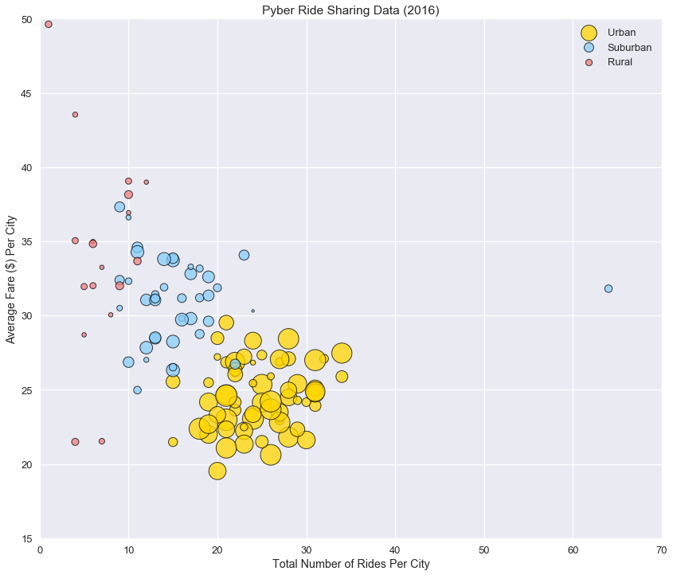
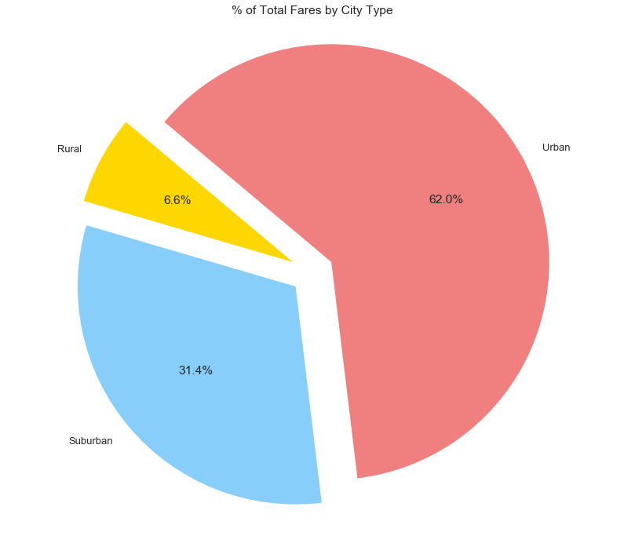
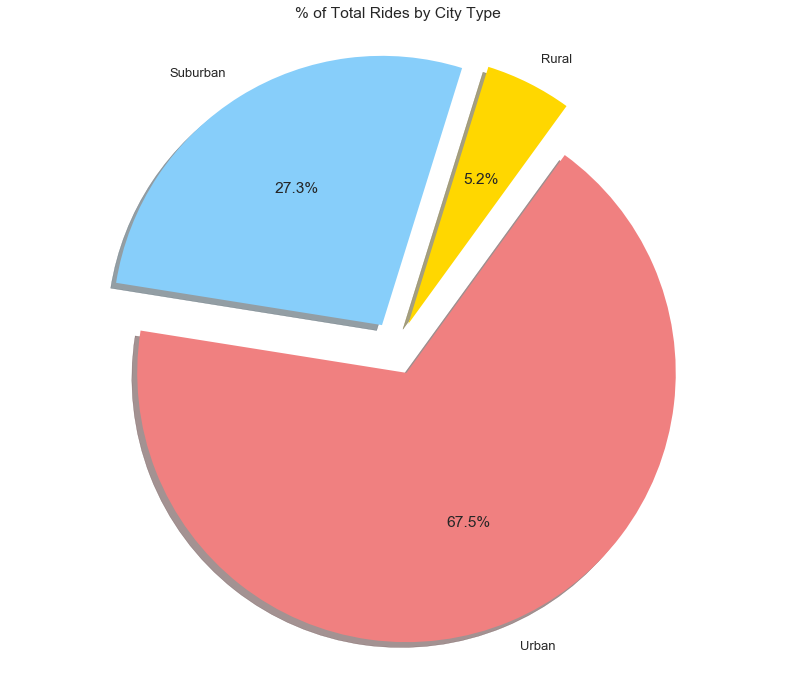
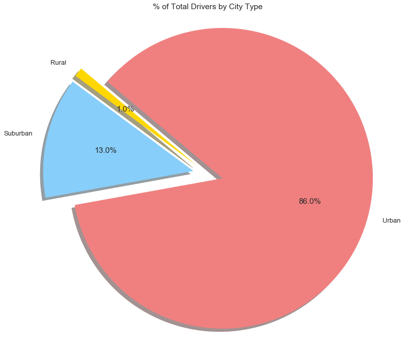

## Findings
* There is a disproportionate number of drivers in urban areas. In the last two pie charts we can see that while around 60% of rides happen in Urban areas around 80% of the drivers are in urban areas
* Looking at the bubble plot while it may seem like most opportunities are in urban areas for uber drivers. The fewer rides that occur in suburban and rural areas have much higher fares.
* A new uber driver might want to consider setting up shop in a suburban or rural area. While only 6% of fares are collected in rural areas only 1% of drivers work there. 31% of fares collected in suburban areas while only having 13% of drivers operate there. 


```python
# import dependencies
import pandas as pd
import matplotlib.pyplot as plt
import seaborn as sns
%matplotlib inline

```


```python
# read in city data and print out first five rows
city = pd.read_csv('Instructions/Pyber/raw_data/city_data.csv')
print("city data")
print("-" * 50)
print(city.head(5))
# read in ride data and print out first five rows
ride = pd.read_csv('Instructions/Pyber/raw_data/ride_data.csv')
print()
print("ride data")
print("-" * 50)
print(ride.head(5))

# Merge in city data to ride data
df = pd.merge(ride, city, on='city')
df.head(10)
```

    city data
    --------------------------------------------------
                 city  driver_count   type
    0      Kelseyland            63  Urban
    1      Nguyenbury             8  Urban
    2    East Douglas            12  Urban
    3   West Dawnfurt            34  Urban
    4  Rodriguezburgh            52  Urban
    
    ride data
    --------------------------------------------------
              city                 date   fare        ride_id
    0     Sarabury  2016-01-16 13:49:27  38.35  5403689035038
    1    South Roy  2016-01-02 18:42:34  17.49  4036272335942
    2  Wiseborough  2016-01-21 17:35:29  44.18  3645042422587
    3  Spencertown  2016-07-31 14:53:22   6.87  2242596575892
    4   Nguyenbury  2016-07-09 04:42:44   6.28  1543057793673
    


<div>
<style>
    .dataframe thead tr:only-child th {
        text-align: right;
    }

    .dataframe thead th {
        text-align: left;
    }

    .dataframe tbody tr th {
        vertical-align: top;
    }
</style>
<table border="1" class="dataframe">
  <thead>
    <tr style="text-align: right;">
      <th></th>
      <th>city</th>
      <th>date</th>
      <th>fare</th>
      <th>ride_id</th>
      <th>driver_count</th>
      <th>type</th>
    </tr>
  </thead>
  <tbody>
    <tr>
      <th>0</th>
      <td>Sarabury</td>
      <td>2016-01-16 13:49:27</td>
      <td>38.35</td>
      <td>5403689035038</td>
      <td>46</td>
      <td>Urban</td>
    </tr>
    <tr>
      <th>1</th>
      <td>Sarabury</td>
      <td>2016-07-23 07:42:44</td>
      <td>21.76</td>
      <td>7546681945283</td>
      <td>46</td>
      <td>Urban</td>
    </tr>
    <tr>
      <th>2</th>
      <td>Sarabury</td>
      <td>2016-04-02 04:32:25</td>
      <td>38.03</td>
      <td>4932495851866</td>
      <td>46</td>
      <td>Urban</td>
    </tr>
    <tr>
      <th>3</th>
      <td>Sarabury</td>
      <td>2016-06-23 05:03:41</td>
      <td>26.82</td>
      <td>6711035373406</td>
      <td>46</td>
      <td>Urban</td>
    </tr>
    <tr>
      <th>4</th>
      <td>Sarabury</td>
      <td>2016-09-30 12:48:34</td>
      <td>30.30</td>
      <td>6388737278232</td>
      <td>46</td>
      <td>Urban</td>
    </tr>
    <tr>
      <th>5</th>
      <td>Sarabury</td>
      <td>2016-08-04 00:25:52</td>
      <td>27.20</td>
      <td>2429366407526</td>
      <td>46</td>
      <td>Urban</td>
    </tr>
    <tr>
      <th>6</th>
      <td>Sarabury</td>
      <td>2016-07-25 10:44:01</td>
      <td>17.73</td>
      <td>4467299640441</td>
      <td>46</td>
      <td>Urban</td>
    </tr>
    <tr>
      <th>7</th>
      <td>Sarabury</td>
      <td>2016-06-22 16:24:01</td>
      <td>23.94</td>
      <td>6153395712431</td>
      <td>46</td>
      <td>Urban</td>
    </tr>
    <tr>
      <th>8</th>
      <td>Sarabury</td>
      <td>2016-01-27 17:46:45</td>
      <td>16.39</td>
      <td>8220809448298</td>
      <td>46</td>
      <td>Urban</td>
    </tr>
    <tr>
      <th>9</th>
      <td>Sarabury</td>
      <td>2016-04-26 11:31:30</td>
      <td>21.80</td>
      <td>5969441875705</td>
      <td>46</td>
      <td>Urban</td>
    </tr>
  </tbody>
</table>
</div>


## Bubbleplot


```python
#group everything by cities
city_groups = df.groupby('city')

#initiate a new dataframe with city types
city_types = city_groups['type'].agg(lambda x:x.value_counts().index[0])
city_df = pd.DataFrame(city_types)
print(city_df.head(5))
```

                      type
    city                  
    Alvarezhaven     Urban
    Alyssaberg       Urban
    Anitamouth    Suburban
    Antoniomouth     Urban
    Aprilchester     Urban
    


```python
# get our y-axis: Average Fare ($) Per City
city_df['avg_city_fares'] = city_groups['fare'].mean()
print(city_df.describe())

```

           avg_city_fares
    count      125.000000
    mean        28.065755
    std          5.104622
    min         19.523000
    25%         24.169474
    50%         27.013333
    75%         31.416154
    max         49.620000
    


```python
# get our x-axis: Total Number of Rides Per City, just a demonstration of what it is. 
city_df['num_rides'] = city_groups['date'].count()
print(city_df.describe())

```

           avg_city_fares   num_rides
    count      125.000000  125.000000
    mean        28.065755   19.256000
    std          5.104622    8.702895
    min         19.523000    1.000000
    25%         24.169474   13.000000
    50%         27.013333   20.000000
    75%         31.416154   25.000000
    max         49.620000   64.000000
    


```python
# Bubble Sizes: Total Number of Drivers Per City
city_df['num_drivers'] = city_groups['driver_count'].mean()
print(city_df.head(10))
```

                      type  avg_city_fares  num_rides  num_drivers
    city                                                          
    Alvarezhaven     Urban       23.928710         31           21
    Alyssaberg       Urban       20.609615         26           67
    Anitamouth    Suburban       37.315556          9           16
    Antoniomouth     Urban       23.625000         22           21
    Aprilchester     Urban       21.981579         19           49
    Arnoldview       Urban       25.106452         31           41
    Campbellport  Suburban       33.711333         15           26
    Carrollbury   Suburban       36.606000         10            4
    Carrollfort      Urban       25.395517         29           55
    Clarkstad     Suburban       31.051667         12           21
    


```python
#adjust size of plots
# Get current size
fig_size = plt.rcParams["figure.figsize"]
 
# Prints: [8.0, 6.0]
print("Current size:", fig_size)
 
# Set figure width to 12 and height to 9
fig_size[0] = 14
fig_size[1] = 12
print("new size: ", fig_size)
plt.rcParams["figure.figsize"] = fig_size
```

    Current size: [16.0, 12.0]
    new size:  [14, 12]
    


```python
sns.set_style('darkgrid')
sns.set_context('talk')

#color code region types
legend_dict = {"Urban":"Gold", "Suburban":"lightskyblue", "Rural":"lightcoral"}


for key,value in legend_dict.items():
    
    df = city_df.loc[city_df['type'] == key]
    
    plt.scatter(x= df['num_rides'],
                y= df['avg_city_fares'],
                marker="o",
                facecolors=value,
                label=key,
                edgecolors="black",
                s=df['num_drivers'] * 10, alpha=0.75,
                linewidth = 1)
    
    
    
plt.ylabel("Average Fare ($) Per City")
plt.xlabel("Total Number of Rides Per City")
# Set the upper and lower limits of our y axis
plt.ylim(15,50)
# Set the upper and lower limits of our x axis
plt.xlim(0,70)

plt.legend(loc=0)
plt.title('Pyber Ride Sharing Data (2016)')
plt.show()
```





## Three types of Pie Charts

* % of Total Fares by City Type
* % of Total Rides by City Type
* % of Total Drivers by City Type


```python
#gotta bring back the old df as the current one was overwritten by the plots
df = pd.merge(ride, city, on='city')
colors = list(legend_dict.values())
```


```python
fares = df.groupby('type').sum()['fare']
print(fares)

```

    type
    Rural        4255.09
    Suburban    20335.69
    Urban       40078.34
    Name: fare, dtype: float64
    


```python

plt.pie(fares.values,explode=(.1 , .1 ,.1), labels=fares.index, colors=colors,
       autopct="%1.1f%%", shadow=False, startangle=140,)
# Create axes which are equal so we have a perfect circle
plt.axis("equal")
plt.title("% of Total Fares by City Type")
plt.show()
```





```python
rides = df.groupby('type').count()['ride_id']
print(rides)
```

    type
    Rural        125
    Suburban     657
    Urban       1625
    Name: ride_id, dtype: int64
    


```python
plt.pie(rides.values,explode=(.1 , .1 ,.1), labels=rides.index, colors=colors,
       autopct="%1.1f%%", shadow=True, startangle=54,)
# Create axes which are equal so we have a perfect circle
plt.axis("equal")
plt.title("% of Total Rides by City Type")
plt.show()
```





```python
drivers = df.groupby('type').sum()['driver_count']
print(drivers)
```

    type
    Rural         727
    Suburban     9730
    Urban       64501
    Name: driver_count, dtype: int64
    


```python
plt.pie(drivers.values,explode=(.1 , .1 ,.1), labels=drivers.index, colors=colors,
       autopct="%1.1f%%", shadow=True, startangle=140,)
# Create axes which are equal so we have a perfect circle
plt.axis("equal")
plt.title("% of Total Drivers by City Type")
plt.show()
```




